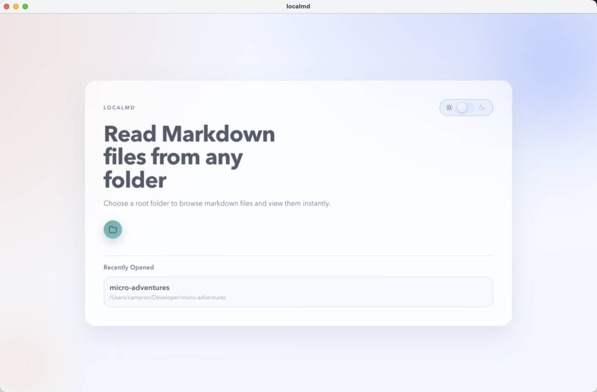
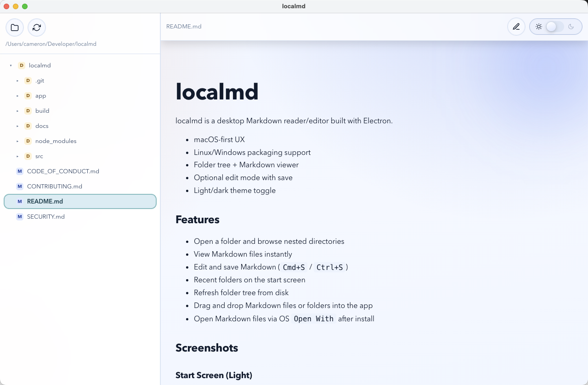
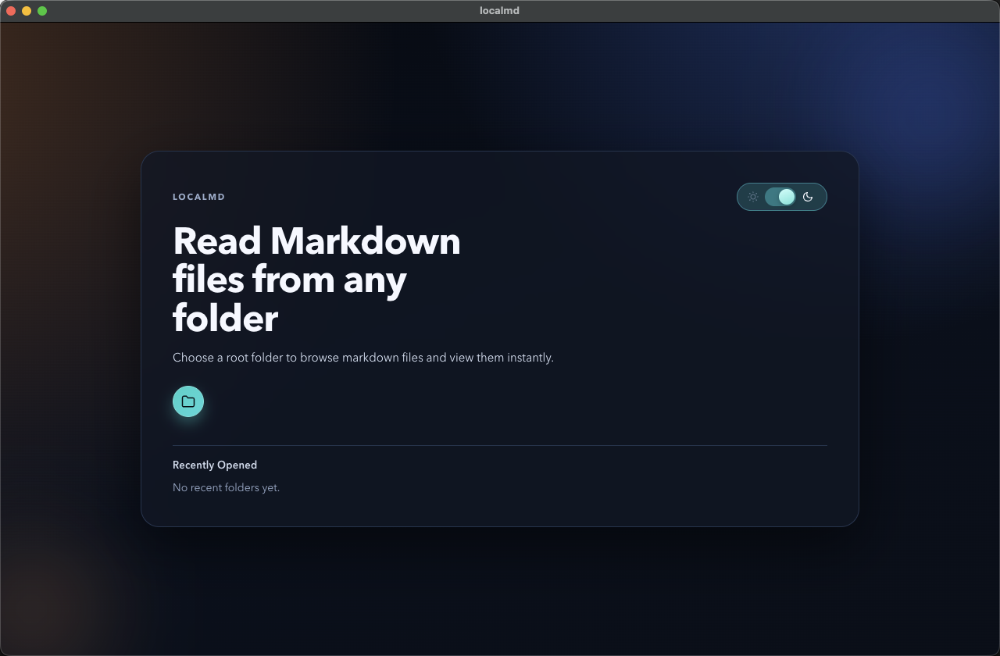
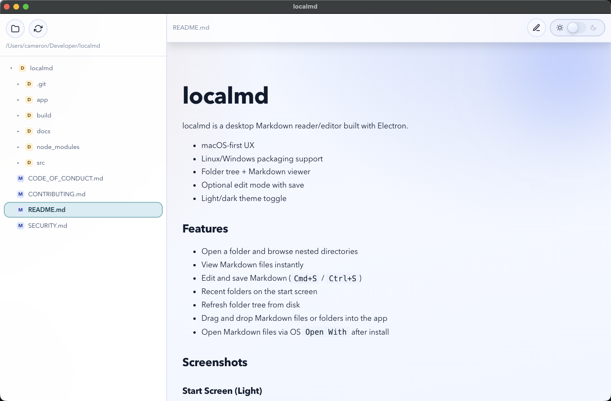

# localmd

localmd is a desktop Markdown reader/editor built with Electron.

- macOS-first UX
- Linux/Windows packaging support
- Folder tree + Markdown viewer
- Optional edit mode with save
- Light/dark theme toggle

## Features

- Open a folder and browse nested directories
- View Markdown files instantly
- Edit and save Markdown (`Cmd+S` / `Ctrl+S`)
- Recent folders on the start screen
- Refresh folder tree from disk
- Drag and drop Markdown files or folders into the app
- Open Markdown files via OS `Open With` after install

## Screenshots

### Start Screen (Light)



### Reader Screen (Light)



### Start Screen (Dark)



### Reader Screen (Dark)



See `docs/SCREENSHOTS.md` for capture guidance.

## Run locally

```bash
npm install
npm start
```

## Build app bundles

```bash
npm run dist:mac
npm run dist:linux
npm run dist:win
```

For a quick local packaging check without generating installers:

```bash
npm run dist:mac -- --dir
```

## macOS packaging and install

1. Build a mac installer:

```bash
npm run dist:mac
```

2. Open the generated DMG in `dist/`.
3. Drag `localmd.app` to `Applications`.

## Open With (.md files)

- After installing `localmd.app` to `Applications`, right click any `.md` file in Finder.
- Choose `Get Info` > `Open with` > `localmd` > `Change All...` (optional).

`localmd` also declares markdown file associations in build metadata, so packaged installs can register it as a markdown editor.

## Security and audit notes

- Runtime dependencies are clean with `npm audit --omit=dev`.
- `npm audit` may still show high-severity findings in transitive *dev/build* tooling (Electron packaging chain).

## Contributing

See `CONTRIBUTING.md`.

## Code of conduct

See `CODE_OF_CONDUCT.md`.

## Security policy

See `SECURITY.md`.

## License

MIT. See `LICENSE`.
